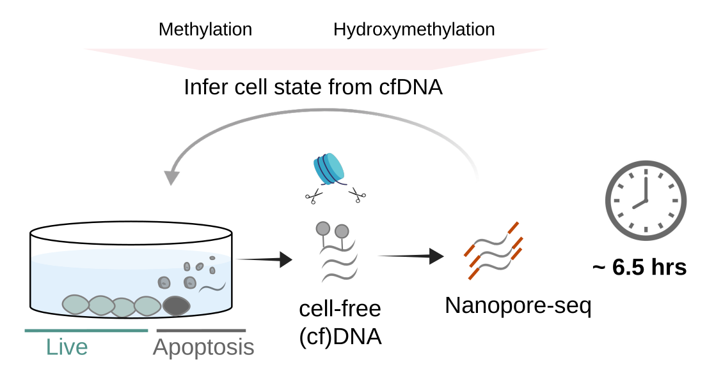

Non-disruptive methylation monitoring of cellular states with cell-free DNA 
===========

Author: Anja Hess

Affiliation: Max Planck Institute for Molecular Genetics, Berlin, Germany

Date (initial repo): 2025-JULY-21
Date (revision updates): 2026-JAN-15

## 1. Description

Scripts to reproduce figures from the manuscript:
Hess, Anja et al. 2026: Non-disruptive in vitro monitoring of cellular states with cell-free DNA methylation

## 2. Before you start

Please make sure you have installed **python => 3.12** and **R =>4.4.2**. Next, download the required packages:

For python-based scripts (majority):

    pip3 install numpy pandas seaborn matplotlib 

For R-based scripts:

    R
    install.packages(c("ggplot2","RColorBrewer", "pheatmap", "circlize", "vioplot"))

The majority of the scripts were run on a 32 GB memory local PC on Ubuntu 24.04.2 LTS. Scripts using larger sequencing data 
as an input (e.g. BAM data such as in Fig. 1E) were run in a **Unix** environment on a remote server (required memory **~ 20-40 GB**).

## 3. Repository structure

### Main (./)
Main folder with this README

### Scripts (./scripts)

Directory with scripts for each figure, named Figure_FigNr_SubfigureNr.py or Figure_FigNr_SubfigureNr.R

### Utils (./scripts/utils)

Utility scripts, for example plotting functions.
- R_plots.R, which is a utility to store simple plotting functions frequently used across figures
- plots.py, serving a similar function as R_plots.R, but for python-based scripts

### Static (./static)

Static images for README

### Results (./results)

Empty directory into which all results (figures and tables) will be saved.

### Source data (./sourcedata)

This folder contains subdirectories for all main figures and the connected panels. Whenever compatible with Github's
file size limitations, the source data is provided to ease reproducing the results. 

### 3.3 A word on large source data 

There are some instances where the scripts take sourcedata as input that are **too large** to be stored within this Github repository. In such cases, we have uploaded the underlying files at the Gene Expression Omnibus (GEO) 
under the accession GSE293866. You will find detailed instructions on how to download and process the files in the **README** stored in the figure's subdirectory.

    ├── 1F
    │   ├── README

In the example above, the .h5ad file underlying Figure 1F can be accessed following the instructions in its folder's README.

## 4. Usage example

First, make sure you follow the **README** to download data not provided with this repository. Make sure you put them into the **correct folder** matching the figure number.

    cd sourcedata/FIG_1/1F/
    wget https://www.ncbi.nlm.nih.gov/geo/download/?acc=GSE293866&format=file&file=WHATEVER_FILE_ID
    ls -l
    3115144544 Dez  8  2024 WGBS_PCA_DNMT1i_mESC.h5ad

The file is now in the correct location, so we can continue. 
To reproduce a figure of choice simply navigate to the main directory and execute the corresponding script. The example below shows you how to reproduce the principal component analysis (PCA) plot for Figure 1F.

    cd scripts
    python3 Figure_1_F.py

This will result in the following output.

    WARNING: saving figure to file results/pcamean-meth.pdf
    UserWarning: FigureCanvasAgg is non-interactive, and thus cannot be shown
      plt.show()

Now navigate to the results folder to find the newly created plot pcamean-meth.pdf

## 5. A word on random seeds

Some of the analyses (e.g., the PCA analysis) employ *random seeds*, and hence the resulting plots
 may vary slightly with every new run. This behavior is expected.
Likewise, due to large data amounts, some of the plots show representative, randomly sampled data points.
Again, a slight deviation of the precise plot optics can occur and is expected for those.

## 6. Data access

Raw and processed sequencing data generated in this study are publicly available on GEO under the accession GSE293866.

## 7. Citation

**Anja Hess, Alexander Kovacsovics, Fabian Bachinger, Helene Kretzmer, Ludovic Vallier and Alexander Meissner: 
Non-disruptive in vitro monitoring of cellular states with cell-free DNA methylation (2026)**

*Fabian Bachinger and  Alexander Kovacsovics contributed equally as second authors to this work.*